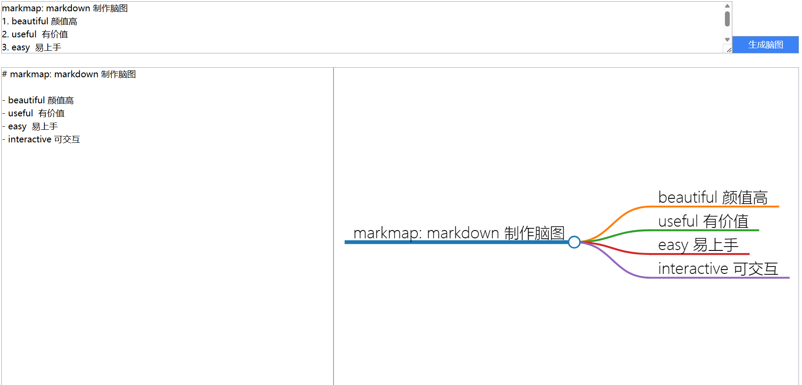

# MindChat
利用ChatGPT 进行脑图制作

     🤗 <a href="https://yfor-mindgpt.hf.space" target="_blank"> Huggingface Space</a>

将文本转换成markdown，再渲染成脑图
* 编辑markdown

## 演示示例

## 参考资料
* [在问](https://www.zaiwen.top/)
* [markmap](https://markmap.js.org/)
